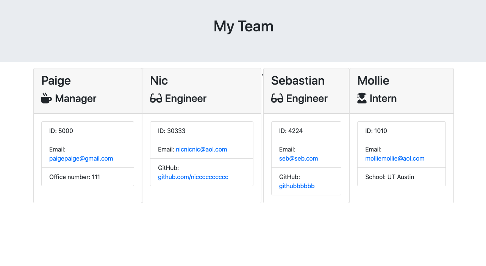
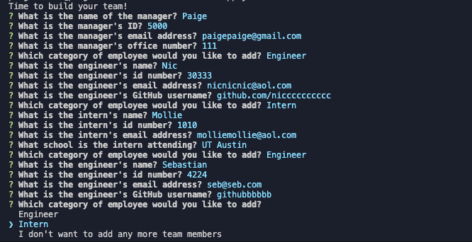

## User Story
As a manager
I want to generate a webpage that displays my team's basic info
so that I have quick access to emails and GitHub profiles

## Description

This is software engineering team generator command line application. The application prompts the user for information about the team manager and then information about the team members. The user can input any number of team members, and they may be a mix of engineers and interns. When the user has completed building the team, the application will create an HTML file that displays a nicely formatted team roster based on the information provided by the user. 

This is an example of a formatted team roster developed from user inputs:

;

## Technologies Used
* The Inquirer npm package prompts the user for their email, id, and information based on their role within the company. 

* The app runs as a Node CLI to gather information about each employee

* The dependencies are Jest for running the provided tests, and Inquirer for collecting input from the user.

* There are also unit tests to help the user build the classes necessary.

* User can use the CLI to generate an HTML page that displays information about their team.

Example of command line application:

;

### How to Use:

The app first prompts the user to build an engineering team. An engineering
team consists of a manager, and any number of engineers and interns.

The app then generates a `team.html` page in the `output` directory, that displays a nicely formatted team roster. Each team member will display the following:

  * Name

  * Role

  * ID

  * Role-specific property (School, link to GitHub profile, or office number)

